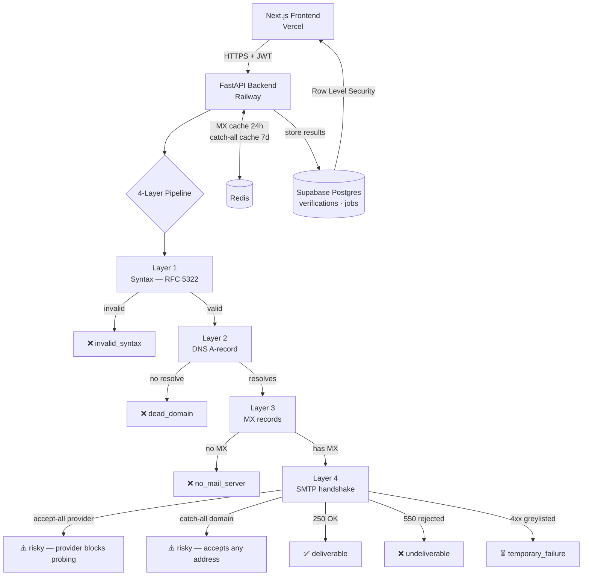

# MailScout

**Free, open-source email verification — verify before you send.**

[](LICENSE)
[](https://www.python.org/)
[](https://fastapi.tiangolo.com)
[](https://nextjs.org)

> **Live demo:** [mailscout.vercel.app](https://mailscout.vercel.app) &nbsp;|&nbsp; **API docs:** [api.mailscout.dev/docs](https://api.mailscout.dev/docs)

---

<!-- Screenshot placeholder — replace with actual screenshot -->


---

## Why I built this

During a cold-email campaign I sourced contact lists by guessing patterns like `firstname@company.com`. The campaign went out. Two days later, my sender domain was flagged — 38% bounce rate, one spam complaint away from blacklisting.

I looked at the tools that would have caught this: Hunter.io ($34/month), NeverBounce ($0.008/email), ZeroBounce ($0.007/email). All of them are thin wrappers around the same three operations: DNS lookup, MX check, SMTP handshake. None of them are open-source.

So I built MailScout. Same four-layer pipeline, MIT-licensed, self-hostable, and free for 100 verifications per month.

---

## Architecture



---

## Tech stack

| Layer | Technology | Why |
|---|---|---|
| Frontend | Next.js 15, Tailwind, shadcn/ui | App Router + RSC, fast iteration |
| Backend | FastAPI, Python 3.11 | Async-first, auto OpenAPI docs |
| Auth | Supabase Auth (JWT) | Free tier, RLS integration |
| Database | Supabase Postgres | Row-Level Security out of the box |
| Cache | Redis (Railway plugin) | MX + catch-all results; fail-soft |
| DNS | dnspython | Async MX record resolution |
| SMTP | aiosmtplib | Non-blocking port 25 handshake |
| Deploy | Railway (backend) + Vercel (frontend) | Zero-config, free-tier friendly |

---

## Local setup

### Prerequisites

- Python 3.11+, Node.js 18+, Docker (for Redis)
- A free [Supabase](https://supabase.com) project

### Backend

```bash
cd mailscout-backend
python -m venv .venv
source .venv/bin/activate        # Windows: .venv\Scripts\activate
pip install -e ".[dev]"

cp .env.example .env
# Fill in: DATABASE_URL, SUPABASE_URL, SUPABASE_KEY, REDIS_URL, FRONTEND_URL

# Apply DB schema (paste into Supabase SQL Editor):
#   migrations/001_initial.sql

docker run -d -p 6379:6379 redis:alpine   # local Redis
uvicorn app.main:app --reload --port 8000
```

API docs: http://localhost:8000/docs

### Frontend

```bash
cd frontend
cp .env.local.example .env.local
# Fill in: NEXT_PUBLIC_SUPABASE_URL, NEXT_PUBLIC_SUPABASE_ANON_KEY
#           NEXT_PUBLIC_API_URL=http://localhost:8000

npm install
npm run dev
```

App: http://localhost:3000

---

## Deploying to production

### Backend → Railway

1. Create a Railway project, add a **Redis** plugin, note `REDIS_URL`
2. Add a new service pointed at this repo, set root directory to `mailscout-backend/`
3. Railway auto-detects the Dockerfile; `railway.json` sets the start command
4. Set environment variables:

| Variable | Value |
|---|---|
| `DATABASE_URL` | Supabase connection string (`postgresql+asyncpg://...`) |
| `SUPABASE_URL` | `https://<ref>.supabase.co` |
| `SUPABASE_KEY` | Supabase service-role key |
| `REDIS_URL` | Injected automatically by Railway Redis plugin |
| `FRONTEND_URL` | Your Vercel deployment URL (enables strict CORS) |
| `LOG_LEVEL` | `INFO` |

### Frontend → Vercel

1. Import repo, set root directory to `frontend/`
2. Set environment variables:

| Variable | Value |
|---|---|
| `NEXT_PUBLIC_SUPABASE_URL` | `https://<ref>.supabase.co` |
| `NEXT_PUBLIC_SUPABASE_ANON_KEY` | Supabase anon key |
| `NEXT_PUBLIC_API_URL` | Railway backend URL |

---

## Limitations

**Gmail, Outlook, Yahoo always return `risky`.**
These providers reject SMTP probing — any `RCPT TO` returns 250 regardless of mailbox existence. This is not a MailScout limitation; Hunter.io, NeverBounce, and ZeroBounce all have the same problem and charge you for it anyway.

**Port 25 is blocked on residential ISPs and Railway's free plan.**
Layers 1–3 (syntax, DNS, MX) work anywhere. The SMTP probe requires a host with outbound port 25 open. On Railway, outbound port 25 is available on paid plans. On a home network, all SMTP results return `risky` with reason "SMTP unavailable". Use Railway Hobby ($5/month) or a VPS.

**Catch-all detection is probabilistic.**
Some servers silently accept any address to prevent enumeration but reject real addresses at delivery time. There is no way to distinguish this without sending an actual message.

**`is_disposable` is always `false` in v1.**
The field is in the schema. Integration with a disposable-domain blocklist is planned for v2.

---

## API

All endpoints except `/health` require `Authorization: Bearer <supabase_jwt>`.

See the [backend README](mailscout-backend/README.md) for full API reference and pipeline documentation.

---

## License

MIT — see [LICENSE](LICENSE).

Built by [Hrithik N L](https://github.com/hrithiknl17).
